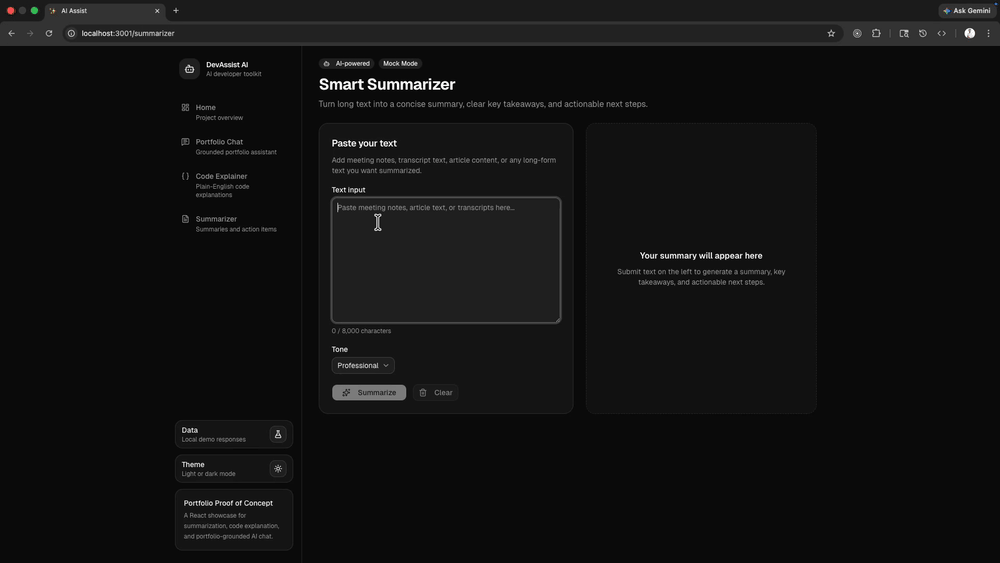
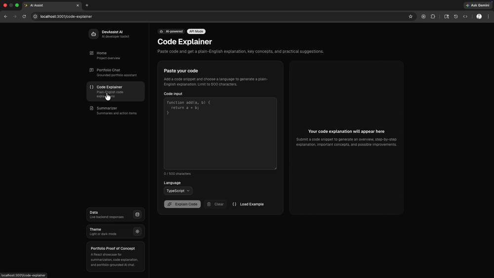
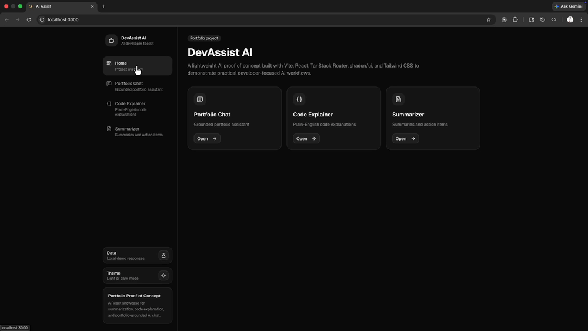
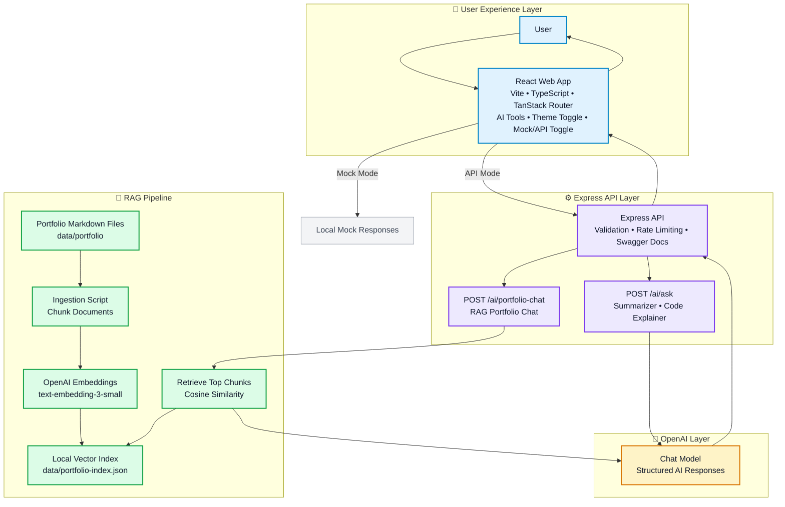
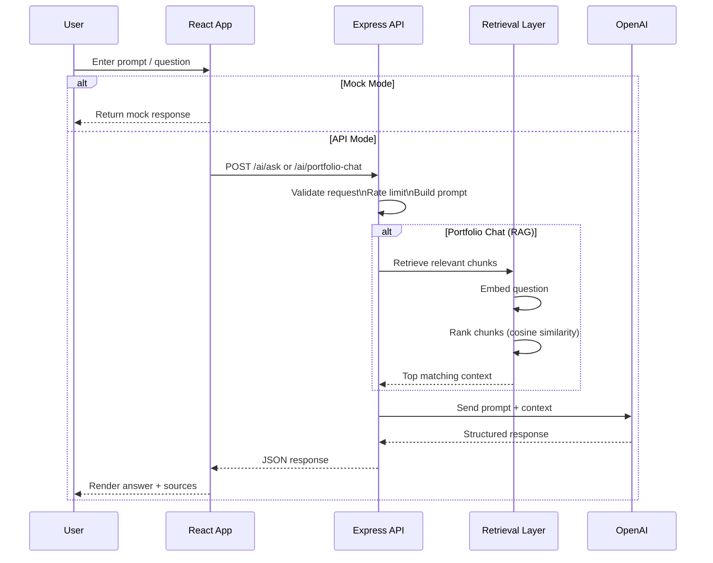

# DevAssist AI

[](https://www.typescriptlang.org/)
[](https://react.dev/)
[](https://vite.dev/)
[](https://expressjs.com/)
[](https://platform.openai.com/docs)
[](https://docs.npmjs.com/cli/using-npm/workspaces)

DevAssist AI is a full-stack AI developer toolkit built with React, Express, TypeScript, and OpenAI. It showcases real-world AI patterns including structured prompting, API orchestration, and a Retrieval-Augmented Generation (RAG) pipeline for grounded responses.

The app is designed to work for two audiences:

- **Non-technical users** can open the web app, choose a tool, and use AI through a polished interface with mock data or real API calls.
- **Technical users** can study the codebase as a working example of OpenAI integration, API validation, rate limiting, Swagger docs, and a simple RAG pipeline.

---

## 🎬 Demo

### 🔍 Portfolio Chat


### ✨ Summarizer



### ✏️ Code Explainer



### 🖥️ Application Overview



These demos showcase real AI workflows including summarization, code explanation, and a RAG-powered portfolio assistant.

---

## ⭐ Key Concept

DevAssist AI demonstrates a full-stack AI architecture where a React frontend communicates with an Express API that manages OpenAI interactions, validation, rate limiting, and a Retrieval-Augmented Generation (RAG) pipeline for grounded responses.

## 🚀 Capabilities

- **Smart Summarizer** turns long text into a summary, key takeaways, and action items.
- **Code Explainer** explains pasted code in plain English with step-by-step notes, important concepts, and improvement ideas.
- **Portfolio Chat** answers questions from local portfolio Markdown documents using RAG.
- **Mock/API toggle** lets the frontend switch between local mock responses and real API calls.
- **Light/dark theme** gives users a persistent theme choice.
- **Swagger docs** document and test the Express API in the browser.

## How The App Works

DevAssist AI has two apps in one npm workspace:

- `apps/web`: React frontend for the AI tools and user experience.
- `apps/api`: Express backend that owns OpenAI calls, API validation, rate limiting, Swagger docs, and portfolio retrieval.

The frontend never calls OpenAI directly. It sends requests to the API, and the API handles secrets, prompt building, embeddings, retrieval, and model calls.

```text
React app
  -> Express API
  -> OpenAI chat and embeddings APIs
  -> structured response back to React
```

## 🏗️ Application Architecture



This architecture keeps OpenAI interactions on the server, enabling secure API usage, controlled prompting, and a reusable RAG pipeline that can scale beyond a single application.

## 🔄 Request Lifecycle (RAG Flow)



This flow shows how DevAssist AI handles both direct AI prompts and RAG-based queries, keeping retrieval, validation, and OpenAI interactions securely within the API layer.

## Tech Stack

### Frontend

- React 19
- TypeScript
- Vite
- TanStack Router
- Tailwind CSS
- shadcn/ui-style components
- Radix UI primitives
- lucide-react icons
- next-themes
- Vitest and Testing Library

### API

- Node.js
- Express 5
- TypeScript
- OpenAI SDK
- dotenv-style environment loading through Node `--env-file`
- CORS
- Swagger JSDoc
- Swagger UI Express
- tsx for local TypeScript development

### Monorepo

- npm workspaces
- Root scripts for running, building, linting, formatting, testing, and portfolio ingestion
- Shared root `package-lock.json`

## Quick Start

Install dependencies from the repo root:

```sh
npm install
```

Create local environment files:

```sh
cp apps/api/.env.example apps/api/.env
cp apps/web/.env.example apps/web/.env
```

Set your OpenAI API key in `apps/api/.env`:

```sh
PORT=5000
OPENAI_API_KEY=your_api_key_here
CORS_ORIGIN=http://localhost:3000
AI_MAX_PROMPT_CHARACTERS=12000
AI_RATE_LIMIT_WINDOW_MS=60000
AI_RATE_LIMIT_MAX_REQUESTS=10
PORTFOLIO_EMBEDDING_MODEL=text-embedding-3-small
PORTFOLIO_CHAT_MODEL=gpt-4o-mini
```

Set the frontend dev configuration in `apps/web/.env`:

```sh
VITE_APP_PORT=3000
VITE_API_URL=http://localhost:5000
```

Run both apps:

```sh
npm run dev
```

Default local URLs:

- Web app: `http://localhost:3000`
- API server: `http://localhost:5000`
- Swagger docs: `http://localhost:5000/swagger`

## Using The App

### Mock Mode vs API Mode

The navigation includes a global `Mock data` / `API calls` toggle.

- **Mock data** uses local mock functions and does not require the API server or an OpenAI key.
- **API calls** sends requests from the frontend to the Express API.
- The selected mode is saved in `localStorage`.
- The toggle applies to Summarizer, Code Explainer, and Portfolio Chat.

For the easiest local workflow, run both apps:

```sh
npm run dev
```

### Smart Summarizer

1. Open the web app.
2. Go to `Summarizer`.
3. Paste meeting notes, article text, transcript content, or other long-form text.
4. Choose a tone: `Professional`, `Concise`, or `Friendly`.
5. Click `Summarize`.

In API mode, the frontend sends the text to `POST /ai/ask` and asks the model to return structured content for the UI.

### Code Explainer

1. Go to `Code Explainer`.
2. Paste code into the form.
3. Select the language.
4. Run the explanation.

In API mode, the app asks for an overview, step-by-step explanation, important concepts, and possible improvements.

### Portfolio Chat

1. Go to `Portfolio Chat`.
2. Ask a question about projects, experience, architecture, frontend work, backend APIs, or AI work.
3. Review the answer and source badges.
4. Continue the conversation or reset the chat.

Before using Portfolio Chat in API mode, generate the retrieval index:

```sh
npm run ingest:portfolio
```

This command reads Markdown files under `data/portfolio`, chunks them, creates embeddings, and writes `data/portfolio-index.json`.

## API Endpoints

The API exposes two AI routes:

```text
POST /ai/ask
POST /ai/portfolio-chat
```

### `POST /ai/ask`

Example request:

```json
{
  "prompt": "Explain React hooks in one paragraph."
}
```

Example response:

```json
{
  "reply": "React hooks let function components manage state and side effects..."
}
```

### `POST /ai/portfolio-chat`

Example request:

```json
{
  "message": "What backend API experience does Steven have?",
  "history": []
}
```

Example response:

```json
{
  "reply": "Steven has experience building Express APIs...",
  "sources": [
    {
      "id": "projects-api-1",
      "label": "API Projects"
    }
  ]
}
```

The API validates request shape, limits prompt size, rate-limits requests per client IP, and keeps the OpenAI API key on the server.

# Technical Deep Dive

## RAG Overview

Retrieval-Augmented Generation, usually shortened to RAG, is a way to make AI answers grounded in your own content. Instead of asking a model to answer from memory, the app retrieves relevant documents first, gives those documents to the model as context, and asks the model to answer from that context.

In DevAssist AI, RAG powers Portfolio Chat.

The flow has five main parts:

1. Store portfolio source content as Markdown files.
2. Split those files into smaller chunks.
3. Generate embeddings for each chunk with OpenAI.
4. Retrieve the most relevant chunks for a user's question.
5. Send the retrieved context to an OpenAI chat model and render the answer in React.

```text
Markdown files
  -> chunk documents
  -> create embeddings
  -> save vector index
  -> embed user question
  -> rank chunks by similarity
  -> build prompt with retrieved context
  -> generate answer
  -> show answer and source badges in React
```

This same pattern can be used for documentation assistants, internal knowledge bases, product support bots, onboarding tools, and other apps where answers need to be grounded in private or project-specific data.

## RAG Implementation Details

### RAG File Structure

The RAG code is split between the API and the React frontend:

```text
apps/api/src/lib/portfolio/
  build-portfolio-chat-messages.ts
  chunk-documents.ts
  embeddings.ts
  index-store.ts
  load-documents.ts
  paths.ts
  retrieve-chunks.ts
  types.ts

apps/api/src/routes/
  portfolio-chat.ts

apps/api/src/scripts/
  ingest-portfolio.ts

apps/web/src/features/portfolio-chat/
  api/portfolio-chat-api.ts
  components/PortfolioChatForm.tsx
  components/PortfolioChatMessages.tsx
  pages/PortfolioChatPage.tsx
  types.ts

data/portfolio/
  notes/
  projects/

data/portfolio-index.json
```

### Step 1: Load Portfolio Documents

The application keeps its knowledge base as Markdown files under `data/portfolio`. Each file becomes a portfolio document with an ID, title, path, and text.

This keeps the first version simple: no database is required to prove the architecture, and the source material stays readable and version controlled.

### Step 2: Chunk The Documents

Large documents are not ideal retrieval units. If a full Markdown file contains several topics, retrieving the whole file can add noise to the model prompt.

The API splits documents into smaller chunks, with a small overlap between chunks. The overlap helps preserve meaning when a useful sentence sits near a chunk boundary.

### Step 3: Create Embeddings

An embedding turns text into a vector, which is a list of numbers that represents semantic meaning. Text with similar meaning should have vectors that are close together.

DevAssist AI uses `text-embedding-3-small` by default:

```ts
const embeddingModel =
  process.env.PORTFOLIO_EMBEDDING_MODEL ?? 'text-embedding-3-small'
```

The API has two embedding helpers:

- `embedTexts` embeds document chunks during ingestion.
- `embedText` embeds one user question at request time.

### Step 4: Build The Vector Index

The ingestion script turns Markdown documents into a local JSON index:

```sh
npm run ingest:portfolio
```

The generated index is saved to:

```text
data/portfolio-index.json
```

For a production system, this JSON file could be replaced by a vector database such as PostgreSQL with pgvector, Pinecone, Qdrant, Weaviate, or another vector store. For a focused proof of concept, JSON keeps the retrieval logic transparent.

### Step 5: Retrieve Relevant Chunks

When the user asks a question, the API embeds that question and compares it with the stored chunk embeddings.

The retrieval code uses cosine similarity, then keeps the top matches:

```ts
export async function retrievePortfolioChunks(
  question: string,
  limit = 4
): Promise<RetrievedPortfolioChunk[]> {
  const [chunks, questionEmbedding] = await Promise.all([
    loadPortfolioIndex(),
    embedText(question),
  ])

  return rankChunks(chunks, questionEmbedding, limit)
}
```

The default limit of `4` gives the model useful context without stuffing the prompt with too much unrelated material.

### Step 6: Build A Grounded Prompt

Retrieval alone is not enough. The model also needs clear instructions about how to use the retrieved content.

The API builds a prompt that includes:

- A system instruction to answer only from retrieved portfolio context.
- Recent chat history, limited to the last six messages.
- Retrieved chunks with source metadata.
- The user's current message.

That source metadata is returned to the frontend and displayed as source badges.

### Step 7: Return Sources In React

Portfolio Chat renders source badges underneath assistant messages. These small badges are an important trust signal because they show which documents shaped the answer.

```tsx
{!isUser && message.sources?.length ? (
  <div className="mt-4 flex flex-wrap gap-2">
    {message.sources.map((source) => (
      <Badge key={source.id} variant="secondary">
        {source.label}
      </Badge>
    ))}
  </div>
) : null}
```

## Why This RAG Design Works

This implementation is intentionally simple, which makes it useful as a learning example.

It keeps the OpenAI key on the server, separates ingestion from runtime chat, returns source metadata to the UI, and instructs the model to answer only from retrieved context. Those choices are the foundation of a reliable RAG app.

## Scripts

Root scripts:

```sh
npm run dev              # Run the API and frontend in parallel
npm run dev:web          # Run the frontend
npm run dev:api          # Run the API
npm run ingest:portfolio # Build the portfolio RAG index
npm run build            # Build all workspaces
npm run build:web        # Build the frontend
npm run build:api        # Build the API
npm run lint             # Lint all workspaces
npm run lint:fix         # Fix lint issues where possible
npm run format           # Format the repo
npm run format:check     # Check formatting
npm run test             # Run tests
npm run test:web         # Run frontend tests
npm run start:api        # Build and start the compiled API
```

## Project Structure

```text
.
├── apps
│   ├── api
│   │   ├── src
│   │   │   ├── app.ts
│   │   │   ├── server.ts
│   │   │   ├── config
│   │   │   ├── lib
│   │   │   │   └── portfolio
│   │   │   ├── middleware
│   │   │   ├── routes
│   │   │   └── scripts
│   │   └── package.json
│   └── web
│       ├── src
│       │   ├── components
│       │   ├── features
│       │   ├── pages
│       │   ├── routes
│       │   └── main.tsx
│       └── package.json
├── assets
├── data
│   └── portfolio
├── package-lock.json
├── package.json
├── RAG_ARTICLE.md
└── tsconfig.json
```

## 🔧 Production Improvements

Possible next steps:

- Replace the JSON vector index with a real vector database.
- Add tests around chunking, retrieval ranking, and API validation.
- Add score thresholds so weak retrieval results trigger an "I do not know" response.
- Stream assistant responses to React for a faster chat experience.
- Track token usage, latency, and retrieval quality.
- Add document refresh workflows when portfolio content changes.
- Link source badges directly to source documents or public URLs.
- Restrict CORS origins for deployed environments.

## 🔗 Related Systems

This project complements:

- NodeMovieApi — backend API architecture
- DotNetMovieApi — multi-stack API implementation
- Postgres Movie Platform — shared data layer

Together, these projects demonstrate full-stack, multi-layer system design across frontend, API, and data platform architectures.

## 👨‍💻 Author

**Steven Wickers**
Senior / Lead Frontend Engineer
React • TypeScript • Node • C# • PostgreSQL • Cloud

---

## 🔍 Keywords

OpenAI API, Retrieval-Augmented Generation (RAG), React, TypeScript, Vite, Express API, Full-Stack AI Application, Embeddings, Prompt Engineering, AI Developer Tools

## Notes

- `apps/api/dist` and `apps/web/dist` are generated build outputs.
- Do not edit generated files in `dist`; update files in `src` and rebuild.
- The frontend dev server proxies `/ai` requests to the API server with Vite.
- API route docs are generated from JSDoc comments in `apps/api/src/routes`.

## References

- [OpenAI embeddings guide](https://platform.openai.com/docs/guides/embeddings)
- [OpenAI embeddings API reference](https://platform.openai.com/docs/api-reference/embeddings)
- [OpenAI Chat Completions API reference](https://platform.openai.com/docs/api-reference/chat/create-chat-completion)
- [OpenAI API authentication guidance](https://platform.openai.com/docs/api-reference/introduction)
